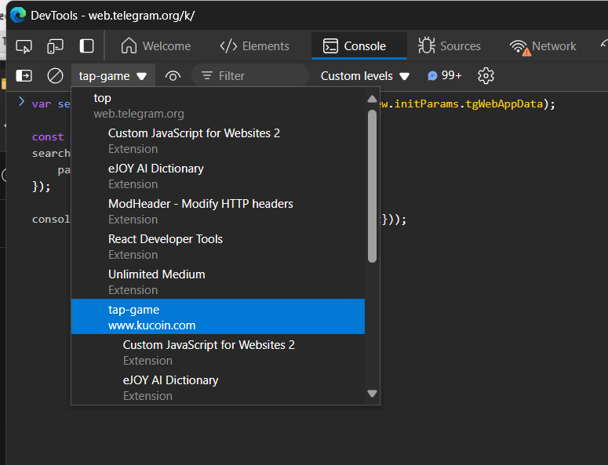
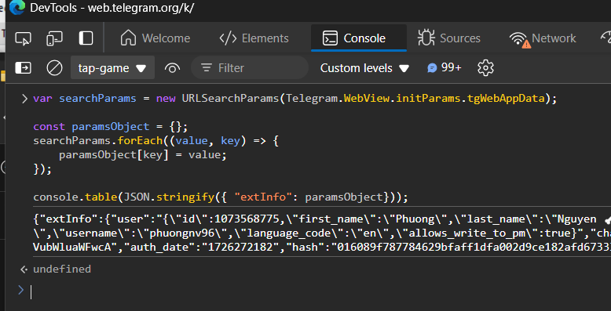
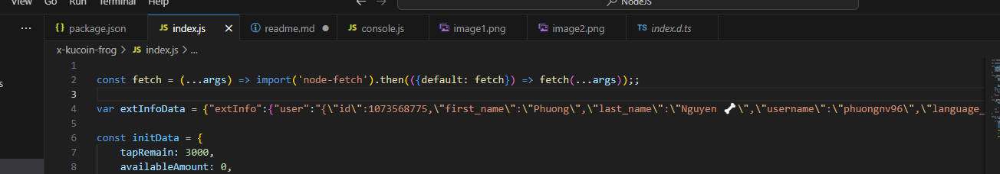

1. Cài NodeJS 

2. Mở Telegram web và mở X Kucoin tap

3. Mở console và chọn context tap-game

    

4. Copy code ở file console.js và dán vào console sau đó enter

    

5. Copy text console và dán vào file index.js

    

6. Cài đặt modules ```node install```

7. Chạy chương trình bằng lệnh ```node index.js```